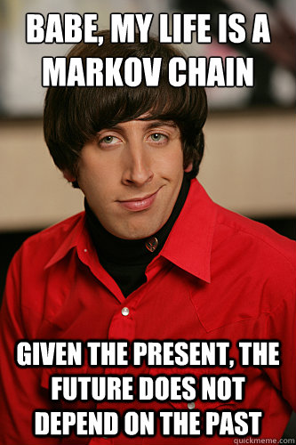

```{r setup, include=FALSE}
knitr::opts_chunk$set(echo = TRUE, message = FALSE)
```

## Task description 
*You are asked to model the behavior of a robot that walks around a ring. The ring is divided into 10 sectors. At any given time point, the robot is in one of the sectors and decides with equal probability to stay in that sector or move to the next sector. You do not have direct observation of the robot. However, the robot is equipped with a tracking device that you can access. The device is not very accurate though: If the robot is in the sector i, then the device will report that the robot is in the sectors [i - 2, i + 2] with equal probability.*


```{r, echo=FALSE, out.height='50%', fig.align='center'}

```
```{r, configurations, echo=FALSE}
set.seed(12345)
rm(list = ls())
library(HMM)
library(entropy)
```

\newpage

## Task 1
*Build a hidden Markov model (HMM) for the scenario described in the task description.*

**ANSWER:**
As explained in the lectures, to build a HMM we need:
  1) An initial model
  2) A emission model
  3) A transition model.
The initial model will not be defined and by default a uniform distribution will be used by the initHMM function from the HMM library. As for the trasition and emission models I define matrices defining the probability of transition/emission in each sector based on the assignment description. 

```{r}
# 10 sectors --> 10 states to be defined and 10 symbols (the observable 
# variables from the emission model)
states = c(LETTERS[1:10])
symbols = c("Ax", "Bx", "Cx", "Dx", "Ex", "Fx", "Gx", "Hx", "Ix", "Jx")

# From the assignment description we know the robot stays in the same state or 
# move to the next with equal probability. From this we can derive the following 
# transition matrix for the 10 states.
transitionMatrix <- t(matrix(data = c(.5,.5,0,0,0,0,0,0,0,0,
                  0,.5,.5,0,0,0,0,0,0,0,
                  0,0,.5,.5,0,0,0,0,0,0,
                  0,0,0,.5,.5,0,0,0,0,0,
                  0,0,0,0,.5,.5,0,0,0,0,
                  0,0,0,0,0,.5,.5,0,0,0,
                  0,0,0,0,0,0,.5,.5,0,0,
                  0,0,0,0,0,0,0,.5,.5,0,
                  0,0,0,0,0,0,0,0,.5,.5,
                  .5,0,0,0,0,0,0,0,0,.5),
                           nrow = length(states),
                           ncol = length(symbols)))

# The assignment description also states that when in sector i the emission 
# model will report the true sector or +-2 sectors with equal probability 
# resulting in the following emission matrix
emissionMatrix <- matrix(data = c(.2,.2,.2,0,0,0,0,0,.2,.2,
                .2,.2,.2,.2,0,0,0,0,0,.2,
                .2,.2,.2,.2,.2,0,0,0,0,0,
                0,.2,.2,.2,.2,.2,0,0,0,0,
                0,0,.2,.2,.2,.2,.2,0,0,0,
                0,0,0,.2,.2,.2,.2,.2,0,0,
                0,0,0,0,.2,.2,.2,.2,.2,0,
                0,0,0,0,0,.2,.2,.2,.2,.2,
                .2,0,0,0,0,0,.2,.2,.2,.2,
                .2,.2,0,0,0,0,0,.2,.2,.2),
                         nrow = length(states),
                         ncol = length(symbols))

HMM <- initHMM(States = states, 
               Symbols = symbols, 
               emissionProbs = emissionMatrix, 
               transProbs = transitionMatrix)

print(HMM)
```
\newpage

## Task 2
*Simulate the HMM for 100 time steps*

Using the simHMM(HMM, 100) to simulate a run with 100 time steps of the created HMM structure

```{r, initialSim, echo=FALSE}
hmm_sim <- simHMM(HMM, 100)
print(hmm_sim)
```
\newpage

## Task 3
*Discard the hidden states from the sample obtained above. Use the remaining observations to compute the filtered and smoothed probability distributions for each of the 100 time points. Compute also the most probable path.*

```{r, probDist}
# Function returning the most probable state given a probability vector 
# describing the probability distribution over the 10 states in a specific time 
# step.
mostProbState <- function(prob_vect) {
  max_index <- which.max(prob_vect)
  most_prob_state <- states[max_index]
  return(most_prob_state)
}

# Using the posterior() function from the HMM library to compute the posterior 
# probabilities of being in state X at time k given the observations simulated 
# in task 2 and the constructed HMM. The Posterior function uses the Forward and 
# Backward probabilities in its calculations as discussed in the lectures.
smooth_dist <- posterior(HMM, hmm_sim$observation)
smooth_most_prob <- apply(X = smooth_dist, MARGIN = 2, FUN = mostProbState)

# Computing the filtered probability distribution with the forward function 
# from the HMM library. Per recommendation using the exp and prob.table 
# functions to get the normalized prob. dist. since the Forward function gives 
# probabilities in log scale.
filtered_dist <- exp(forward(HMM, hmm_sim$observation))
filtered_dist_norm <- apply(X = filtered_dist, MARGIN = 2, FUN = prop.table)
filtered_most_prob <- apply(X = filtered_dist_norm, MARGIN = 2, FUN = mostProbState)

# Computing the most probable path with the viterbi algorithm
most_prob_path <- viterbi(hmm = HMM, observation = hmm_sim$observation)
```
Showing the results by extracting a fraction of the time steps and their respective distribution for the filtered and the smooth distributions 
```{r echo=FALSE}
print("Smooth distribution over 5 first time steps")
print(smooth_dist[1:10,1:5])
print("Filtered distribution over 5 first time steps")
print(filtered_dist_norm[1:10,1:5])
print("Most probable path")
print(most_prob_path)
```
\newpage

## Task 4
*Compute the accuracy of the filtered and smoothed probability distributions, and of the most probable path. That is, compute the percentage of the true hidden states that are guessed by each method*

```{r}
# Function to determine the accuracy in the predicted states vs the true states
# from the HMM from the initHMM. Takes the predicted states and the true tates 
# as in parameters and return a percentage of correctly classified states.  
stateAcc <- function(pred_states, true_states) {
  num_states <- length(pred_states)
  acc_res <- rep(0, num_states)
  for(i in 1:num_states) {
    if(pred_states[i] == true_states[i]) {
      acc_res[i] = 1
    } else {
      acc_res[i] = 0
    }
  }
  correct_pred <- sum(acc_res)
  pred_acc <- correct_pred/num_states
  return(pred_acc)
}

# Smooth accuracy
smooth_acc <- stateAcc(smooth_most_prob, hmm_sim$states)
print(paste("Smooth acc: ", smooth_acc))

# Filtered accuracy
filtered_acc <- stateAcc(filtered_most_prob, hmm_sim$states)
print(paste("Filtered acc: ", filtered_acc))

# Most probable path accuracy
path_acc <- stateAcc(most_prob_path, hmm_sim$states)
print(paste("Path acc: ", path_acc))

```
\newpage

## Task 5
*Repeat the previous exercise with different simulated samples. In general, the smoothed distributions should be more accurate than the filtered distributions. Why? In general, the smoothed distributions should be more accurate than the most probable paths, too. Why?*

**ANSWER:** 
The smoothed distribution should be more accurate than the filtered since it conditions on all the observations where the filtered distribution only conditions on the data observations up until that point in time. The smooth distribution calculation uses both the forward and backward probabilities calculated from the forward- and backward-function to calculate the posterior probability. Whereas the filtered distribution only looks at the forward probabilities using the forward-function.

When comparing the accuracy of the smoothed distribution with the most probable path the smoothed distribution should have a better accuracy here as well. This is because the viterbi algorithm (calculating the most probable sequence) takes neighbors in consideration and imposes an additional constraint. The smoothed distribution calculation on the other hand does not take sequence into account and looks at each time step individually, maximizing its marginal probability. Hence it makes sense that it has higher accuracy since "accuracy" in this case does not care about the sequence, but compares each estimated state with the true state individually. 

The smoothed distribution can be seen to be higher than both the filtered and most probable path distributions in the two accuracy plots below. No matter the number of time steps or the seed.
```{r}
# Function to calculate the Smooth, Filtered and Path accuracy given a HMM, a 
# number of time steps and a seed. Also returns the probability distribution 
# for both the Filtered and Smooth calculations. Set time steps constent and 
# alter seed or vice versa for useful insights.
simulationStepComputation <- function(hmm, time_steps, seed) {
  # Setting seed
  if(!missing(seed)) {
    set.seed(seed)
  }
  
  # Initializing the simulated HMM
  HMM_simulation <- simHMM(hmm,time_steps)
  
  # Smooth (_new is added to the calculated variables to differ from the 
  # previous task variables).
  smooth_dist_new <- posterior(HMM, HMM_simulation$observation)
  smooth_most_prob_new <- apply(X = smooth_dist_new,
                                MARGIN = 2,
                                FUN = mostProbState)
  smooth_acc_new <- stateAcc(smooth_most_prob_new, HMM_simulation$states)

  # Filtered
  filtered_dist_new <- exp(forward(HMM, HMM_simulation$observation))
  filtered_dist_norm_new <- apply(X = filtered_dist_new, 
                                  MARGIN = 2, 
                                  FUN = prop.table)
  filtered_most_prob_new <- apply(X = filtered_dist_norm_new, 
                                  MARGIN = 2, 
                                  FUN = mostProbState)
  filtered_acc_new <- stateAcc(filtered_most_prob_new, HMM_simulation$states)

  # Most probable path
  most_prob_path_new <- viterbi(hmm = HMM, 
                                observation = HMM_simulation$observation)
  path_acc_new <- stateAcc(most_prob_path_new, HMM_simulation$states)
  
  accuracy <- data.frame(Smooth = smooth_acc_new, 
                         Filtered = filtered_acc_new, 
                         Path = path_acc_new)
  result <- list("accuracy" = accuracy,
              "smooth_dist" = smooth_dist_new,
              "filtered_dist" = filtered_dist_new)
  return(result)
}

# The simmulated_samples varibale can be used to see how the different
# accuracies alters when the number of time steps increases
simmulated_samples = c(50, 100, 150, 200, 250, 300, 350, 400, 450, 500, 550, 
                       600, 650, 700, 750, 800, 850, 900, 950, 1000)
# Number of seeds decides the number of different simulated samples that will
# be tested.
number_of_seeds = 10

# Accuracy data frames for the results
accs_df <- data.frame(Smooth=numeric(0), 
                      Filtered = numeric(0), 
                      Path = numeric(0))
accs_df_2 <- data.frame(Smooth=numeric(0), 
                        Filtered = numeric(0), 
                        Path = numeric(0))

# Testing with different numer of time steps
for(i in 1:length(simmulated_samples)) {
  simulation_step <- simulationStepComputation(hmm = HMM, 
                                             time_steps = simmulated_samples[i])
  accs_df <- rbind(accs_df, simulation_step$accuracy)
}

# Testing with different simulated samples (different seeds but the same amount
# of time steps) 
for(i in 1:number_of_seeds) {
  simulation_step_2 <- simulationStepComputation(hmm = HMM, 
                                                 time_steps = 200, seed = i)
  accs_df_2 <- rbind(accs_df_2, simulation_step_2$accuracy)
}

# Preparations for plotting 
library(ggplot2)
accs_df <- cbind(Time_steps = simmulated_samples, accs_df)
accs_df_2 <- cbind(Seed = c(1:number_of_seeds), accs_df_2)

# Accuracy over altering time steps plot
ggplot(data = accs_df, mapping = aes(x=Time_steps)) +
  ylim(0, 1) +
  xlim(50, 1000) +
  labs(x = "Time steps", y = "Accuracy", color = "Y labels") +
  geom_line(aes(y = Smooth, color = "Smooth")) +
  geom_line(aes(y = Filtered, color = "Filtered")) +
  geom_line(aes(y = Path, color = "Path")) +
  scale_x_continuous(breaks = accs_df$Time_steps) +
  ggtitle("Accuracy with altering time steps")

# Accuracy over altering seed plot
ggplot(data = accs_df_2, mapping = aes(x=Seed)) +
  ylim(0, 1) +
  xlim(1, 5) +
  labs(x = "Seed", y = "Accuracy", color = "Y labels") +
  geom_line(aes(y = Smooth, color = "Smooth")) +
  geom_line(aes(y = Filtered, color = "Filtered")) +
  geom_line(aes(y = Path, color = "Path")) +
  scale_x_continuous(breaks = accs_df_2$Seed) +
  ggtitle("Accuracy with altering seed")

```
\newpage

## Task 6
*Is it true that the more observations you have the better you know where the robot is?*

**ANSWER:**
To test this in practice I have computed the accumulated mean for both the filtered and the smooth distribution entropy over one simulation with 300 time steps. As can be seen by the plot below the accumulated entropy oscillates  before it converges to a rather stable mean after around 130 time steps. So it seems that up until around 130 observations you get better and better entropy and knows more certain where the robot is. But after that there is little benefits of more observations with regards to knowing where the robot is.
```{r}
sim <- simulationStepComputation(HMM, 300)
smooth_ent <- apply(sim$smooth_dist, 2,entropy.empirical)
filtered_ent <- apply(sim$filtered_dist, 2,entropy.empirical)
accumulated_mean_smooth <- numeric(300)
accumulated_mean_filtered <- numeric(300)
for (i in 1:300) {
  accumulated_mean_smooth[i] <- mean(smooth_ent[1:i])
  accumulated_mean_filtered[i] <- mean(filtered_ent[1:i])
}
accumulated_mean_df <- data.frame(t(rbind(accumulated_mean_filtered, 
                                          accumulated_mean_smooth, 
                                          time_steps =(1:300))))
ggplot(data = accumulated_mean_df, mapping = aes(x=time_steps)) +
  xlim(0, 300) +
  labs(x = "Time steps", y = "Entropy", color = "Y labels") +
  geom_line(aes(y = accumulated_mean_smooth, color = "Smooth")) +
  geom_line(aes(y = accumulated_mean_filtered, color = "Filtered")) +
  ggtitle("Accumulated mean for filtered and smooth distribution entropy")
```
\newpage

## Task 7
*Consider any of the samples above of length 100. Compute the probabilities of the hidden states for the time step 101.*

**ANSWER:**
This is calculated simply by looking at the filtered probability distribution of step 100 and multiplying by the transition matrix giving a prediction for state 101. To quote the report meme: "Babe, my life is a Markov chain. *"Given the present, I don't need the past to predict the future."* The present being the probability distribution step 100. 
```{r}
state_100 <- filtered_dist_norm[,100]
state_101 <- state_100 %*% transitionMatrix 
print(state_100)
print(state_101)
```