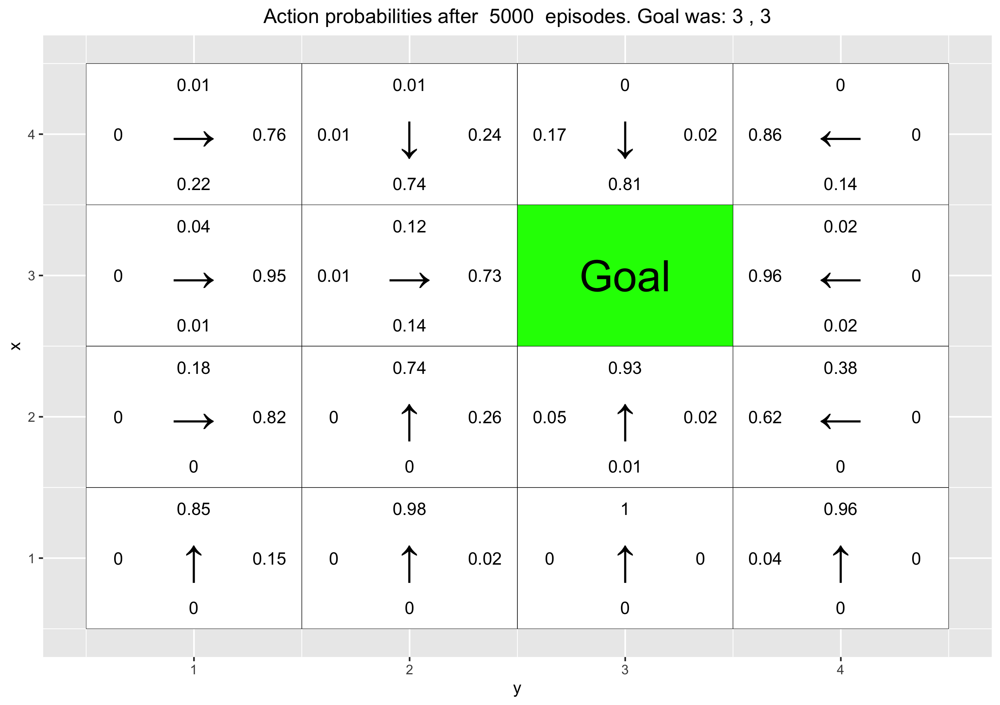

```{r setup, include=FALSE}
knitr::opts_chunk$set(echo = TRUE)
```
```{r, config, echo=FALSE}
set.seed(12345)
```
## Q-learning
*The file RL Lab1.R in the course website contains a template of the Q- learning algorithm.1 You are asked to complete the implementation. We will work with a grid-world environment consisting of H × W tiles laid out in a 2-dimensional grid. An agent acts by moving up, down, left or right in the grid-world. This corresponds to the following Markov decision process:*
```{r, image_container, echo=FALSE, out.width='70%', fig.align='center'}

```
*Additionally, we assume state space to be fully observable. The reward function is a deterministic function of the state and does not depend on the actions taken by the agent. We assume the agent gets the reward as soon as it moves to a state. The transition model is defined by the agent moving in the direction chosen with probability (1-Beta). The agent might also slip and end up moving in the direction to the left or right of its chosen action, each with probability Beta/2. The transition model is unknown to the agent, forcing us to resort to model-free solutions. The environment is episodic and all states with a non-zero reward are terminal. Throughout this lab we use integer representations of the different actions: Up=1, right=2, down=3 and left=4.*
\newpage

## Environment A
*For our first environment, we will use H = 5 and W = 7. This environ- ment includes a reward of 10 in state (3,6) and a reward of -1 in states (2,3), (3,3) and (4,3). We specify the rewards using a reward map in the form of a matrix with one entry for each state. States with no reward will simply have a matrix entry of 0. The agent starts each episode in the state (3,1).*

### Task 1: Greedy and Epsilon-greedy policies
*Implement the greedy and Epsilon-greedy policies in the functions GreedyPolicy and EpsilonGreedyPolicy of the file RL Lab1.R. The functions should break ties at random, i.e. they should sample uniformly from the set of actions with maximal Q- value.*
```{r, Q-learning_greedy}
GreedyPolicy <- function(x, y){
  # The rank() function returns the sample ranks of the values in a vector. 
  # By specifying the tie method to random it will rank the equally high scores 
  # at random internally. Which.max() then returns the index of the highest 
  # rank, which then is the direction to move in.
  index=which.max(rank(q_table[x,y,], ties.method = "random"))
  return (index)
}

EpsilonGreedyPolicy <- function(x, y, epsilon){
  # Vector of possible directions to move in
  moves <- c(1,2,3,4)
  # Randoms a float between 0 and 1. If lower than epsilon and action is taken
  # at random, else it will perform the GreedyPolicy. 
  r <- runif(1)
  if(r<epsilon) {
   return(sample(x = moves, size = 1))
  }
  return(GreedyPolicy(x,y))
}
```
### Task 2: Q-learning algorithm
*Implement the Q-learning algorithm in the function q learning of the file RL Lab1.R. The function should run one episode of the agent acting in the environment and update the Q-table accordingly. The function should return the episode reward and the sum of the temporal-difference correction terms R + Gamma maxaQ(S, a) - Q(S, A) for all steps in the episode. Note that a transition model taking Beta as input is already implemented for you in the function transition model.*
```{r, Q-learning_algorithm}
q_learning <- function(start_state, epsilon = 0.5, alpha = 0.1, gamma = 0.95, 
                       beta = 0){
  current_state <- start_state
  episode_correction <- 0
  repeat{
    # Follow policy, execute action, get reward.
    # Get next action
    action <- EpsilonGreedyPolicy(current_state[1], current_state[2], epsilon)
    # Get new state by executing the transition
    new_state <- transition_model(current_state[1], current_state[2], action, 
                                  beta)
    # Calculate the correction
    correction <- gamma*max(q_table[new_state[1], new_state[2], ]) 
    - q_table[current_state[1], current_state[2], action]
    reward <- reward_map[new_state[1], new_state[2]]
    
    # Q-table update.
    q_table[current_state[1], current_state[2], action] <<- 
      q_table[current_state[1], current_state[2], action] + 
      alpha*(reward + correction)
    
    # Set current_state to new_state and aggregate the step correction
    current_state <- new_state
    episode_correction <- episode_correction + correction
    
    # End episode.
    if(reward!=0)
      return (c(reward,episode_correction))
  }
}
```
### Task 3: Running the Q-algorithm
*Run 10000 episodes of Q-learning with Epsilon = 0.5, Beta = 0, Alpha = 0.1 and Gamma = 0.95. To do so, simply run the code provided in the file RL Lab1.R. The code visualizes the Q-table and a greedy policy derived from it after episodes 10, 100, 1000 and 10000. Answer the following questions:*

**3.1:** *What has the agent learned after the first 10 episodes?*

After the ten first 10 episodes the agent has taken a path from the start state to the goal state one time. Since it has not reached the goal state more than once, only one of the adjacent state of the +10 goal state has a positive q-value. The rest of the policy runs have been halted by the robot reaching the negative end states and the agent has therefor learned some about the negative reward states' location. This is something to be expected after such few iterations in an environment where the negative end states creates an "obstacle" between the start state and the goal state. 

```{r, image_container_2, echo=FALSE, out.width='80%', fig.align='center'}
knitr::include_graphics("Qtable_10_iterations.png")
```

**3.2:** *Is the final greedy policy (after 10000 episodes) optimal? Why / Why not?*

The final greedy policy is good but it could be a little bit better. For the policy to be optimal it should take the closest route to goal state. This is not true for the final greedy policy, we can see this in arrows in the states in the upper left corner of the plot for 10 000 iterations. In an optimal policy, these arrows should lead to the agent going over the red area instead of under since it is a closer route. Since $\beta$ = 0 in this environment, the policy does not have to take into account that it could slip into the red area, if $\beta$ /= 0, then the optimal policy should try to take the closest route while still having as big a margin to areas with negative reward. 

```{r, echo=FALSE, fig.show='hold', fig.align='center', out.width="80%"}

```

**3.3:** *Does the agent learn that there are multiple paths to get to the positive reward? If not, what could be done to make the agent learn this?*

No, not really. An example of a better path that is not learned is the path discussed before. Looking at the final greedy policy the agent still thinks its better to loop around the whole red area when in state (5,3) instead of going right and reaching the goal state faster. To make the agent learn paths like these you could change the exploration factor epsilon to be higher. Another thing you could do is to initializing the starting state at random. 

\newpage

## Environment B
*This is a 7×8 environment where the  top and bottom rows have negative rewards. In this environment, the agent starts each episode in the state (4, 1). There are two positive rewards, of 5 and 10. The reward of 5 is easily reachable, but the agent has to navigate around the first reward in order to find the reward worth 10.*

### Task 4: Investigate the Epsilon and Gamma parameters
*Your task is to investigate how the Epsilon and Gamma parameters affect the learned policy by running 30000 episodes of Q-learning with Epsilon = 0.1, 0.5, Gamma = 0.5, 0.75, 0.95, Beta = 0 and Alpha = 0.1. To do so, simply run the code provided in the file RL Lab1.R and explain your observations.*

**Settings:** Epsilon = {0.1, 0.5}, alpha = 0.1, beta = 0, gamma = {0.5, 0.75, 0.95}

```{r, echo=FALSE, fig.show='hold', fig.align='center', out.width="49%"}

knitr::include_graphics("wImages/10.png")


knitr::include_graphics("wImages/19.png")
knitr::include_graphics("wImages/22.png")
```
As shown in the first two plots above , when $\epsilon$ = 0.5 and $\gamma$ = 0.5, 0.75, the agent does not find the reward worth 10 if it does not pass the first reward by chance. This is since with $\gamma$ = 0.5, 0.75, a higher reward diminishes quite fast and is not as appealing as with a higher $\gamma$.The fact still remains though, that the higher the gamma value, the more likely are we to learn a policy with the end reward of +10. This is something expected since the higher the gamma, the less we prefer immediate but lower rewards over later higher rewards. This makes the reward from the +10 goal state overtake the significance of the +5 goal state at a gamma = 0.95

The runs with $\epsilon$ = 0.1 are displayed in the last three plots above. Looking at them, we can see that the agent never finds the state with the reward worth 10. This is due to the fact that when $\epsilon$ is low, the agent will more often choose the action that it think is optimal and not try new routes that potentially could lead to greater rewards. 

As one can see in the last three plots, when $\epsilon$ = 0.1, the agent almost never takes a step beyond the tile with a reward of 5 as the low exploration rate makes it go straight to the tile with a reward of 5. This can also be seen in the graph below showing the rolling mean of the rewards where it almost always 5. 

```{r, echo=FALSE, fig.show='hold', fig.align='center', out.width="49%"}
knitr::include_graphics("wImages/reward_gamma_0_7_5_epsilon_0_1.png")
knitr::include_graphics("wImages/reward_gamma_0_9_5_epsilon_0_1.png")
```

One can also look at the correction graph. The correction graph (see below) shows the correction of each step. This shows how much of a correction that occurs with each step. The difference between the two graphs below are quite significant. The higher value of $\epsilon$ leads to more variation and mainly a higher correction overall. What this means is that with each episode the correction of the q values are higher. The reason for is that the higher the probability of acting greedily is the more different paths and more will be discovered and the more correction is done each step and episode.

```{r, echo=FALSE, fig.show='hold', fig.align='center', out.width="49%"}
knitr::include_graphics("wImages/correction_gamma_0_9_5_epsilon_0_1.png")
knitr::include_graphics("wImages/correction_gamma_0_9_5_epsilon_0_5.png")
```

**Summation:**

1) With higher $\epsilon$ more states are visited.
2) When setting a larger $\gamma$, meaning that the value of the new q-state is less discounted, the agent is able to find the larger reward since it values it more.
3) A low $\epsilon$ will inhibit the Agent from finding the larger reward even when $\gamma$ is close to 1.

## Task 5: Investigate the $\beta$ parameter in environment C
*This is a smaller 3 × 6 environment. Here the agent starts each episode in the state (1,1). Your task is to investigate how the $\beta$ parameter affects the learned policy by running 10000 episodes of Q-learning with $\beta$ = 0, 0.2, 0.4, 0.66, $\epsilon$ = 0.5, $\gamma$ = 0.6 and $\alpha$ = 0.1. To do so, simply run the code provided in the file RL Lab1.R and explain your observations.*

The $\beta$ factor plays part of the transition equation, being the parameter to decide the uncertainty in the action taken. With a high $\beta$ value there is a high risk that the step you are telling the agent to take is not the step it will end up performing. It will "slip" with the probability $\beta$ When moving across the environment in this example it then makes sense that the agent will learn to be more cautious when there is high risk to slip by taking a detour to distance itself more from the negative end state along the bottom row. By taking this behavior it ensures the higher average reward. 

Another interesting observation is that when $\beta$ = 0,66, the optimal policy in state (2,5) can be to go to the right instead of going straigth down to the reward. This is due to the fact that it is only a 33% chance that the agent will end up in the state with high reward if it goes down, but it also runs the risk of going backwards. But it will never risk slipping to the red negative end state. This is not a result shown in these plots but something that occured for other runs in this lab for some of our group members.

```{r, echo=FALSE, fig.show='hold', fig.align='center', out.width="45%"}


knitr::include_graphics("b04.png")
knitr::include_graphics("b066.png")
```

## Reinforce
## Envirnment D
*In this task, we will use eight goal positions for training and, then, validate the learned policy on the remaining eight possible goal positions. The training and validation goal positions are stored in the lists train goals and val goals in the code in the file RL Lab2.R. You are requested to run the code provided, which runs the REINFORCE algorithm for 5000 episodes with Beta = 0 and Gamma = 0.95.3 Each training episode uses a random goal position from train goals. The initial position for the episode is also chosen at random. When training is completed, the code validates the learned policy for the goal positions in val goals. This is done by with the help of the function vis prob, which shows the grid, goal position and learned policy. Note that each non-terminal tile has four values. These represent the action probabilities associated to the tile (state). Note also that each non-terminal tile has an arrow. This indicates the action with the largest probability for the tile (ties are broken at random).*

### Task 6: Questions on environment D
```{r}
train_goals <- list(c(4,1), c(4,3), c(3,1), c(3,4), c(2,1), c(2,2), c(1,2), c(1,3))
val_goals <- list(c(4,2), c(4,4), c(3,2), c(3,3), c(2,3), c(2,4), c(1,1), c(1,4))
```
**6.1:** *Has the agent learned a good policy? Why / Why not?*

Displayed below are the final policies for all the goal states in val_goals. From the images we can see that the agent has learned a good policy. Where ever you start in the environment you will reach the goal state. Thanks to the goal states the agent trained on being selected at random there is a good spread and the agent will not become biased, some level of generalization has occurred. 
```{r, echo=FALSE, fig.show='hold', out.width="33%"}
knitr::include_graphics("rImages/9.png")

knitr::include_graphics("rImages/11.png")


knitr::include_graphics("rImages/14.png")
knitr::include_graphics("rImages/15.png")
knitr::include_graphics("rImages/16.png")
```

**6.2:** *Could you have used the Q-learning algorithm to solve this task?*

A Q-learning algorithm would no be a good choice for this type of problem. This is due to the fact that the agent in Q-learning only can make decisions on what it has previously discovered unlike the the REINFORCE algorithm which generalizes it's solution in a way that it can use the model to find new goals that it has never before experienced.  

### Task 6: Questions on environment E
*You are now asked to repeat the previous experiments but this time the goals for training are all from the top row of the grid. The validation goals are three positions from the rows below. To solve this task, simply run the code provided in the file RL Lab2.R and answer the following questions:*

```{r}
train_goals <- list(c(4,1), c(4,2), c(4,3), c(4,4))
val_goals <- list(c(3,4), c(2,3), c(1,1))
```
**6.1:** *Has the agent learned a good policy? Why / Why not?*
No it has not. It will not always find the goal state as seen looking at the policies for each of the validation goals below:
```{r, echo=FALSE, fig.show='hold', out.width="33%"}


```

**6.2:** *If the results obtained for environments D and E differ, explain why.*

They differ because the training goal states for environment E are all on the top row. This makes the agent become biased during training and when executing on new validation goal states not in this row, it will perform badly. This highlights the importance of well spread and random initiated training data spread over the full solution space. 
