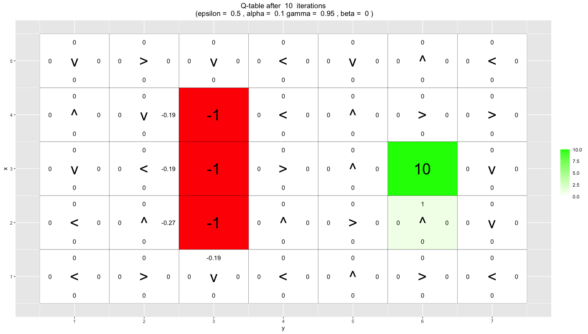
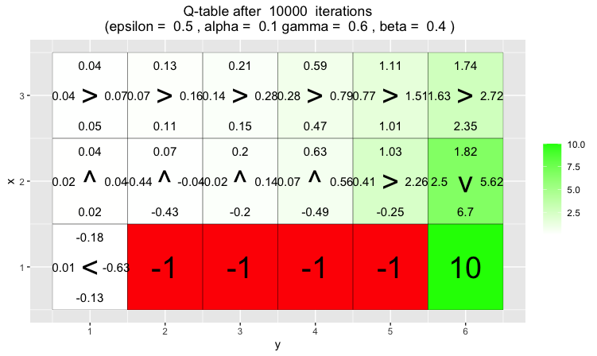
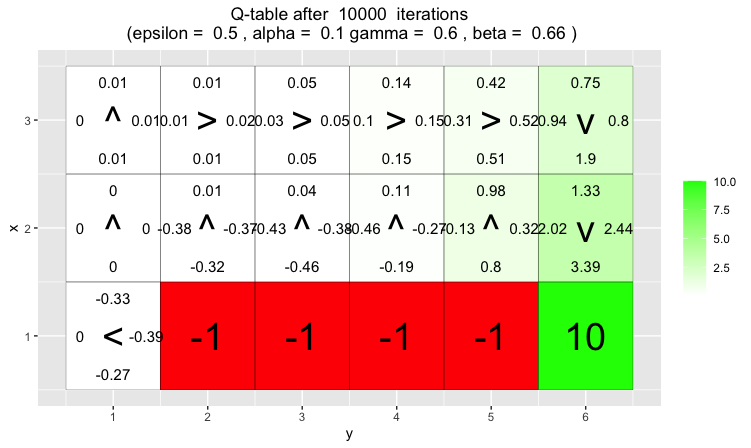
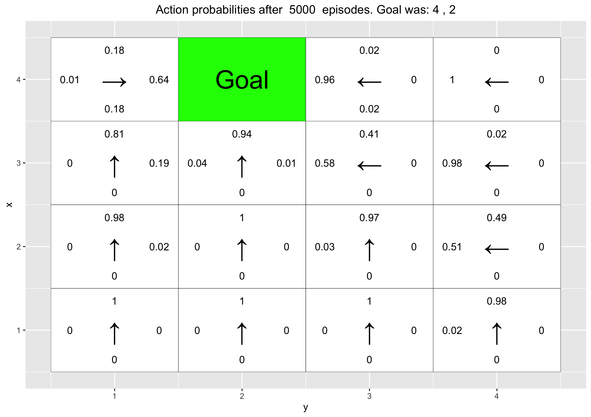

```{r setup, include=FALSE}
knitr::opts_chunk$set(echo = TRUE, message = FALSE, warning = FALSE)
```

```{r, Meme, echo=FALSE, out.height='50%', fig.align='center'}
knitr::include_graphics("meme.jpeg")
```
\newpage
```{r, config, echo=FALSE}
set.seed(12345)
```
## Q-learning
*The file RL Lab1.R in the course website contains a template of the Q- learning algorithm.1 You are asked to complete the implementation. We will work with a grid-world environment consisting of H × W tiles laid out in a 2-dimensional grid. An agent acts by moving up, down, left or right in the grid-world. This corresponds to the following Markov decision process:*
```{r, image_container, echo=FALSE, out.width='70%', fig.align='center'}
knitr::include_graphics("state_and_action_space.png")
```
*Additionally, we assume state space to be fully observable. The reward function is a deterministic function of the state and does not depend on the actions taken by the agent. We assume the agent gets the reward as soon as it moves to a state. The transition model is defined by the agent moving in the direction chosen with probability (1-Beta). The agent might also slip and end up moving in the direction to the left or right of its chosen action, each with probability Beta/2. The transition model is unknown to the agent, forcing us to resort to model-free solutions. The environment is episodic and all states with a non-zero reward are terminal. Throughout this lab we use integer representations of the different actions: Up=1, right=2, down=3 and left=4.*

## Environment A
*For our first environment, we will use H = 5 and W = 7. This environ- ment includes a reward of 10 in state (3,6) and a reward of -1 in states (2,3), (3,3) and (4,3). We specify the rewards using a reward map in the form of a matrix with one entry for each state. States with no reward will simply have a matrix entry of 0. The agent starts each episode in the state (3,1). The function vis environment in the file RL Lab1.R is used to visualize the environment and learned action values and policy. You will not have to modify this function, but read the comments in it to familiarize with how it can be used.*

*When implementing Q-learning, the estimated values of Q(S,A) are commonly stored in a data-structured called Q-table. This is nothing but a tensor with one entry for each state- action pair. Since we have a H × W environment with four actions, we can use a 3D-tensor of dimensions H × W × 4 to represent our Q-table. Initialize all Q-values to 0. Run the function vis environment before proceeding further. Note that each non-terminal tile has four values. These represent the action values associated to the tile (state). Note also that each non-terminal tile has an arrow. This indicates the greedy policy for the tile (ties are broken at random).*
\newpage

### Task 1: Greedy and Epsilon-greedy policies
*Implement the greedy and Epsilon-greedy policies in the functions GreedyPolicy and EpsilonGreedyPolicy of the file RL Lab1.R. The functions should break ties at random, i.e. they should sample uniformly from the set of actions with maximal Q- value.*

**ANSWER:**
```{r, Q-learning_greedy}
GreedyPolicy <- function(x, y){
  # The rank() function returns the sample ranks of the values in a vector. 
  # By specifying the tie method to random it will rank the equally high scores 
  # at random internally. Which.max() then returns the index of the highest 
  # rank, which then is the direction to move in.
  index=which.max(rank(q_table[x,y,], ties.method = "random"))
  return (index)
}

EpsilonGreedyPolicy <- function(x, y, epsilon){
  # Vector of possible directions to move in
  moves <- c(1,2,3,4)
  # Randoms a float between 0 and 1. If lower than epsilon and action is taken
  # at random, else it will perform the GreedyPolicy. 
  r <- runif(1)
  if(r<epsilon) {
   return(sample(x = moves, size = 1))
  }
  return(GreedyPolicy(x,y))
}
```
### Task 2: Q-learning algorithm
*Implement the Q-learning algorithm in the function q learning of the file RL Lab1.R. The function should run one episode of the agent acting in the environment and update the Q-table accordingly. The function should return the episode reward and the sum of the temporal-difference correction terms R + Gamma maxaQ(S, a) - Q(S, A) for all steps in the episode. Note that a transition model taking Beta as input is already implemented for you in the function transition model.*

**ANSWER:**
```{r, Q-learning_algorithm}
q_learning <- function(start_state, epsilon = 0.5, alpha = 0.1, gamma = 0.95, 
                       beta = 0){
  current_state <- start_state
  episode_correction <- 0
  repeat{
    # Follow policy, execute action, get reward.
    # Get next action
    action <- EpsilonGreedyPolicy(current_state[1], current_state[2], epsilon)
    # Get new state by executing the transition
    new_state <- transition_model(current_state[1], current_state[2], action, 
                                  beta)
    # Calculate the correction
    correction <- gamma*max(q_table[new_state[1], new_state[2], ]) 
    - q_table[current_state[1], current_state[2], action]
    reward <- reward_map[new_state[1], new_state[2]]
    
    # Q-table update.
    q_table[current_state[1], current_state[2], action] <<- 
      q_table[current_state[1], current_state[2], action] + 
      alpha*(reward + correction)
    
    # Set current_state to new_state and aggregate the step correction
    current_state <- new_state
    episode_correction <- episode_correction + correction
    
    # End episode.
    if(reward!=0)
      return (c(reward,episode_correction))
  }
}
```
### Task 3: Running the Q-algorithm
*Run 10000 episodes of Q-learning with Epsilon = 0.5, Beta = 0, Alpha = 0.1 and Gamma = 0.95. To do so, simply run the code provided in the file RL Lab1.R. The code visualizes the Q-table and a greedy policy derived from it after episodes 10, 100, 1000 and 10000. Answer the following questions:*

**3.1:** *What has the agent learned after the first 10 episodes?*

After the ten first 10 episodes the agent has taken a path from the start state to the goal state one time. Since it has not  reached the goal state more than once only the adjacent, previous, state of the +10 goal state has a positive q-value.The rest of the policy runs have been halted by the robot reaching the negative end states and the agent has therefor learned some about the negative reward states' location. As can be seen in the picture below, some of the states around the red state space have negative q-values in the direction of the red states. So when entering these states the robot will not choose the direction of the red states.
```{r, image_container_2, echo=FALSE, out.width='80%', fig.align='center'}

```

**3.2:** *Is the final greedy policy (after 10000 episodes) optimal? Why / Why not?*

It is not optimal. Or rather, it is not optimal if the definition of optimal is to reach the goal state as fast as possible, no matter the starting state. This can be seen by looking at for example state (5,3) where the greedy policy is telling us to go left and around the red area instead of the closest path That is right and down. However, if there is no urgency to reach the goal state this greedy policy can be said to be an optimal one, since it will never make the agent end up in a red end state and will always make us reach the goal state. 

```{r, echo=FALSE, fig.show='hold', fig.align='center', out.width="80%"}
knitr::include_graphics("Q-table_10000_iterations.png")
```

**3.3:** *Does the agent learn that there are multiple paths to get to the positive reward? If not, what could be done to make the agent learn this?*

No, not really. An example of a better path that is not learned is the path discussed before. Looking at the final greedy policy the agent still thinks its better to loop around the whole red area when in state (5,3) instead of going right and reaching the goal state faster. To make the agent learn paths like these you could change the exploration factor epsilon to be higher. Another thing you could do is to initializing the starting state at random. 
\newpage

## Environment B
*This is a 7×8 environment where the  top and bottom rows have negative rewards. In this environment, the agent starts each episode in the state (4, 1). There are two positive rewards, of 5 and 10. The reward of 5 is easily reachable, but the agent has to navigate around the first reward in order to find the reward worth 10.*

### Task 4: Investigate the Epsilon and Gamma parameters
*Your task is to investigate how the Epsilon and Gamma parameters affect the learned policy by running 30000 episodes of Q-learning with Epsilon = 0.1, 0.5, Gamma = 0.5, 0.75, 0.95, Beta = 0 and Alpha = 0.1. To do so, simply run the code provided in the file RL Lab1.R and explain your observations.*

**Settings:** Epsilon = 0.5, alpha = 0.1, beta = 0, gamma = {0.5, 0.75, 0.95}

Looking at the end Q-tables for these settings, where we alter the gamma parameter, one can see that the higher the gamma value the more likely are we to learn a policy with the end reward of +10. This is something expected since the higher the gamma, the less we prefer immediate but lower rewards over later higher rewards. This makes the reward from the +10 goal state overtake the significance of the +5 goal state at a gamma = 0.95. For gamma = 0.5 and 0.75 there is still a "blockade" at the y=5 column that will prohibit any greedy policy path starting from y<=5 to reach the +10 goal state since beta = 0.

```{r, echo=FALSE, fig.show='hold', fig.align='center', out.width="80%"}


```
This is something you can also see in the moving average correction and reward plots. For both gamma = 0.5 and 0.75 the moving average reward oscillates around 4.5 indicating that a policy with a path to end goal +10 never occurs. Comparing this to when gamma = 0.95, where there is a clear jumping increase in the moving average reward at around index 1250 indicating the agent found a policy to the +10 reward.

```{r, echo=FALSE, fig.show='hold', fig.align='center', out.width="45%"}


```
**Settings:** Epsilon = 0.1, alpha = 0.1, beta = 0, gamma = {0.5, 0.75, 0.95}

In this experiment the Epsilon parameter (the exploration factor) is set to 0.1 instead of 0.5. What is interesting here is that when we have such a low exploration chance of our state space, we are unlikely to reach the further   +10 goal state. Even if the gamma (discount factor) is set as high as 0.95. This is because there is so low probability that we take an action at random. Hence, when the goal state of +5 is found we will not deviate from that policy very likely. This low exploration of states can be seen when looking at the visualization of the Q-tables below, where some of the states have never been reached and has the initial **0** q-value vector. Typically states far away from the start state at (4,1). For gamma = 0.5 and 0.75 the +10 goal state is never explored.

```{r, echo=FALSE, fig.show='hold', fig.align='center', out.width="45%"}


```
```{r, echo=FALSE, fig.show='hold', fig.align='center', out.width="80%"}

```


## Task 5: Investigate the beta parameter in environment C
*This is a smaller 3 × 6 environment. Here the agent starts each episode in the state (1,1). Your task is to investigate how the Beta parameter affects the learned policy by running 10000 episodes of Q-learning with Beta = 0, 0.2, 0.4, 0.66, Epsilon = 0.5, Gamma = 0.6 and Alpha = 0.1. To do so, simply run the code provided in the file RL Lab1.R and explain your observations.*

The Beta factor plays part of the transition equation, being the parameter to decide the uncertainty in the action taken. With a high Beta value there is a high risk that the step you are telling the agent to take is not the step it will end up performing. It will "slip" with the probability Beta. When moving across the environment in this example it then makes sense that the agent will learn to be more cautious when there is high risk to slip by taking a detour to distance itself more from the negative end state along the bottom row. By taking this behavior it ensures the higher average reward. 

```{r, echo=FALSE, fig.show='hold', fig.align='center', out.width="45%"}
knitr::include_graphics("b0.png")
knitr::include_graphics("b02.png")


```
## Reinforce
*The file RL Lab2.R in the course website contains an implementation of the REINFORCE algorithm.2 Your task is to run the code provided and answer some ques- tions. Although you do not have to modify the code, you are advised to check it out to familiarize with it. The code uses the R package keras to manipulate neural networks.*

*We will work with a 4 × 4 grid. We want the agent to learn to navigate to a random goal position in the grid. The agent will start in a random position and it will be told the goal position. The agent receives a reward of 5 when it reaches the goal. Since the goal position can be any position, we need a way to tell the agent where the goal is. Since our agent does not have any memory mechanism, we provide the goal coordinates as part of the state at every time step, i.e. a state consists now of four coordinates: Two for the position of the agent, and two for the goal position. The actions of the agent can however only impact its own position, i.e. the actions do not modify the goal position. Note that the agent initially does not know that the last two coordinates of a state indicate the position with maximal reward, i.e. the goal position. It has to learn it. It also has to learn a policy to reach the goal position from the initial position. Moreover, the policy has to depend on the goal position, because it is chosen at random in each episode. Since we only have a single non-zero reward, we do not specify a reward map. Instead, the goal coordinates are passed to the functions that need to access the reward function.*

## Envirnment D
*In this task, we will use eight goal positions for training and, then, validate the learned policy on the remaining eight possible goal positions. The training and validation goal positions are stored in the lists train goals and val goals in the code in the file RL Lab2.R. You are requested to run the code provided, which runs the REINFORCE algorithm for 5000 episodes with Beta = 0 and Gamma = 0.95.3 Each training episode uses a random goal position from train goals. The initial position for the episode is also chosen at random. When training is completed, the code validates the learned policy for the goal positions in val goals. This is done by with the help of the function vis prob, which shows the grid, goal position and learned policy. Note that each non-terminal tile has four values. These represent the action probabilities associated to the tile (state). Note also that each non-terminal tile has an arrow. This indicates the action with the largest probability for the tile (ties are broken at random).*
\newpage


### Task 6: Questions on environment D
```{r}
train_goals <- list(c(4,1), c(4,3), c(3,1), c(3,4), c(2,1), c(2,2), c(1,2), c(1,3))
val_goals <- list(c(4,2), c(4,4), c(3,2), c(3,3), c(2,3), c(2,4), c(1,1), c(1,4))
```
**6.1:** *Has the agent learned a good policy? Why / Why not?*

Displayed below are the final policies for all the goal states in val_goals. From the images we can see that the agent has learned a good policy. Where ever you start in the environment you will reach the goal state. Thanks to the goal states the agent trained on being selected at random there is a good spread and the agent will not become biased, some level of generalization has occured. 
```{r, echo=FALSE, fig.show='hold', out.width="33%"}

knitr::include_graphics("rImages/10.png")
knitr::include_graphics("rImages/11.png")
knitr::include_graphics("rImages/12.png")
knitr::include_graphics("rImages/13.png")
knitr::include_graphics("rImages/14.png")
knitr::include_graphics("rImages/15.png")
knitr::include_graphics("rImages/16.png")
```

**6.2:** *Could you have used the Q-learning algorithm to solve this task?*

No it will not work to use the Q-learning algorithm to solve this task. This is because the q-learning algorithm can only create policies for goal states it has already seen, compared to the neural network that can generalize and thereby create policies for unseen goal states as well. 


### Task 6: Questions on environment E
*You are now asked to repeat the previous experiments but this time the goals for training are all from the top row of the grid. The validation goals are three positions from the rows below. To solve this task, simply run the code provided in the file RL Lab2.R and answer the following questions:*

```{r}
train_goals <- list(c(4,1), c(4,2), c(4,3), c(4,4))
val_goals <- list(c(3,4), c(2,3), c(1,1))
```
**6.1:** *Has the agent learned a good policy? Why / Why not?*
No it has not. It will not always find the goal state as seen looking at the policies for each of the validation goals below:
```{r, echo=FALSE, fig.show='hold', out.width="33%"}
knitr::include_graphics("rImages/4.png")
knitr::include_graphics("rImages/5.png")
knitr::include_graphics("rImages/6.png")
```

**6.2:** *If the results obtained for environments D and E differ, explain why.*

They differ because the training goal states for environment E are all on the top row. This makes the agent become biased during tra   ining and when executing on new validation goal states not in this row, it will perform badly. This highlights the importance of well spread and random initiated training data spread over the full solution space. 
